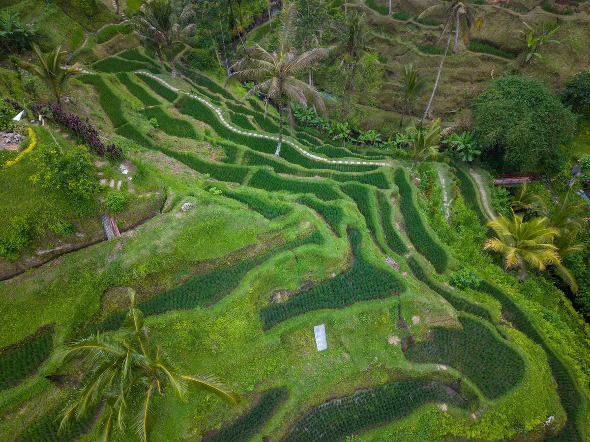
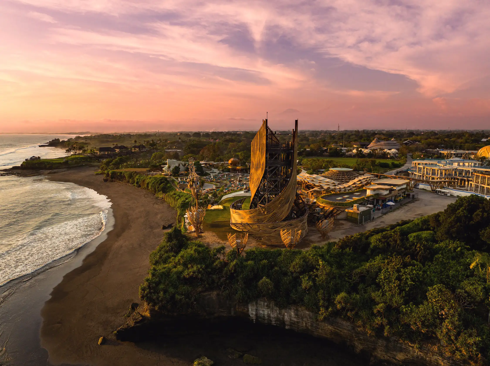
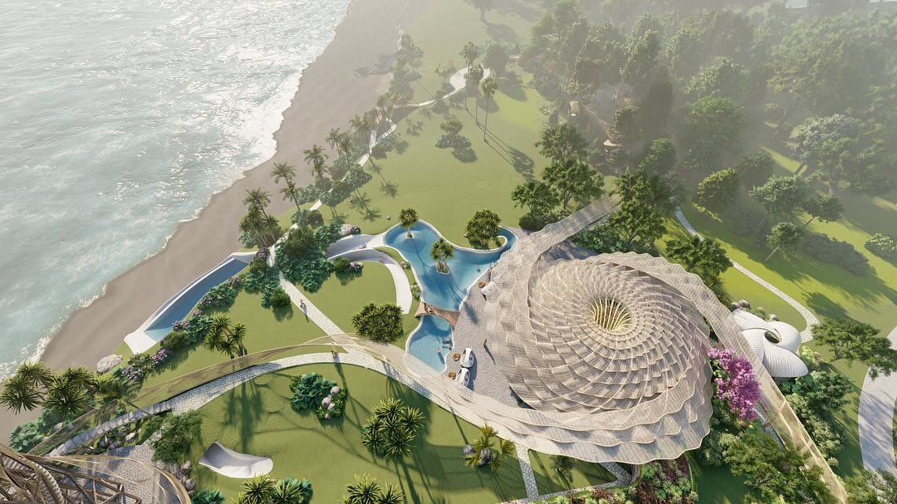
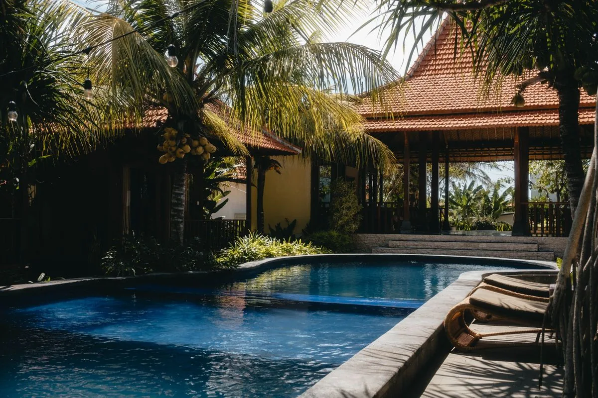
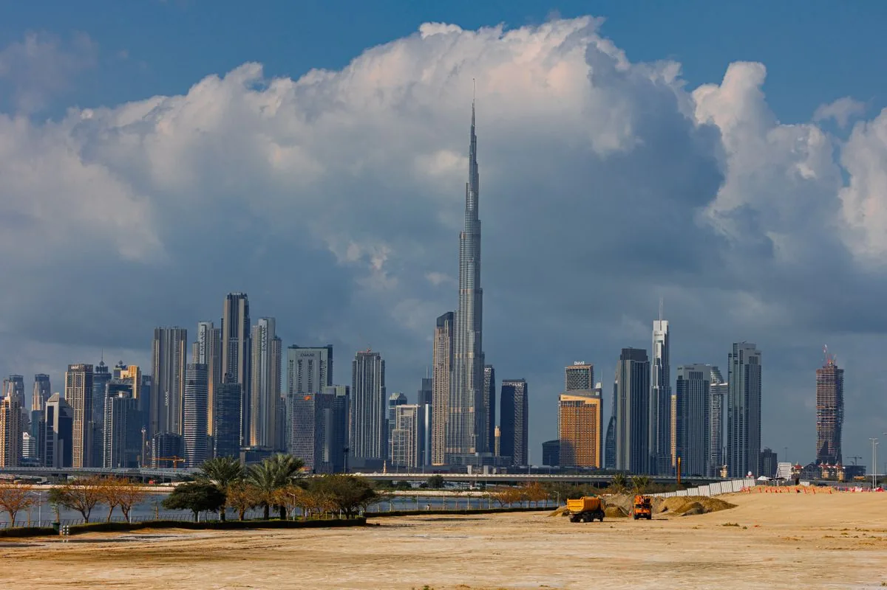
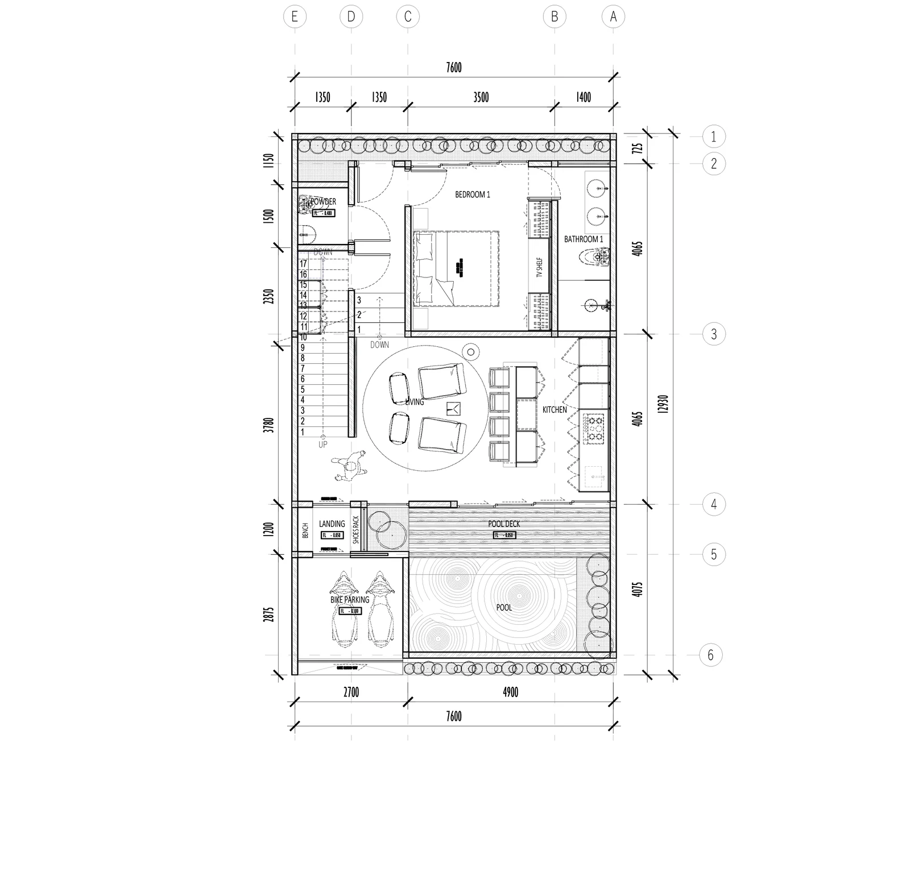
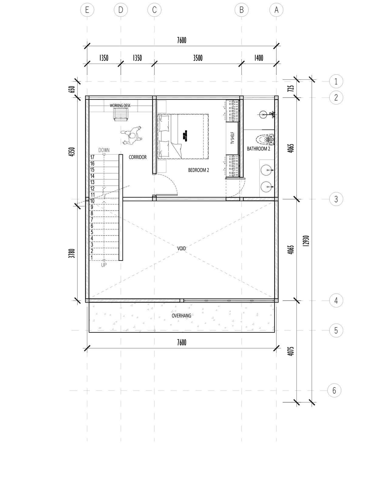

# OMA Townhouse

### Off-plan modern tropical townhouse in Kaba Kaba, Tabanan, Bali

**Investor pitch deck**

[omatownhouse.com](https://www.omatownhouse.com) • Kaba Kaba, Tabanan, Bali, Indonesia

---

## The thesis in one slide

A 2-bedroom modern tropical townhouse with private pool, 25 minutes from Canggu, on land priced up to **70% below** Canggu — at the leading edge of where the next wave of Bali development is already funded and under construction.

- **Entry from $115,000** (25-year leasehold, first-building promo)
- **Freehold from $265,000** via PT PMA (long-term ownership)
- **Fully managed Airbnb option**: we run cleaning, guest comms, airport transfers, maintenance — **18% commission on rental profit + fixed monthly fee**. You sit on your chair.
- **Why now**: Bali's 2025 ban on rice-field conversion caps competing supply in Tabanan, and Nuanu Creative City (44 hectares, school + hotels + beach club) is already opening 10 minutes away.

> Numbers in this deck are framed as ranges, not promises. This is general information and not financial, legal or tax advice.

---

## What you are buying

| Spec | Detail |
|---|---|
| Bedrooms | 2 |
| Building size | 97.5 sqm (66.7 ground + 30.8 upper) |
| Footprint | 8.78 m × 7.6 m ground, 4.06 m × 7.6 m upper |
| Pool | Private |
| Style | Modern tropical, double-height living, rice-field outlook |
| Amenities | Private pool, high-speed WiFi, parking, garden, 24/7 security |
| Use | Personal home, Airbnb / long-stay rental, or both |

Floor plans included with this deck (see `assets/floor-plans/`).

---

## Gallery

| | |
|:---:|:---:|
|  |  |
| *Living area* | *Kitchen and living* |
|  |  |
| *Master bedroom* | *Bedroom (TV wall)* |
|  |  |
| *Bathroom* | *Home office* |
|  |  |
| *Entryway* | *Street view* |

All 11 high-resolution scenes are linked in `ASSETS.md`.

---

## Where it is

Kaba Kaba is a village in Kediri district, Tabanan Regency. Inland from the beach road, surrounded by rice terraces — but with everything Canggu offers a short drive away.

**From OMA Townhouse:**

| Destination | Drive |
|---|---|
| Kaba Kaba Social (cafe, coworking) | 2–5 min |
| Ulaman Resort | 5–10 min |
| Kedungu Beach | 10–15 min |
| Nuanu Creative City / Luna Beach Club | 10–15 min |
| Tanah Lot Temple | 10–15 min |
| Open House Seseh | 15–20 min |
| Pererenan (gyms, cafes) | 20–25 min |
| Canggu (Batu Bolong, Berawa) | 25–30 min |
| Seminyak | 35–40 min |
| Ngurah Rai Airport (DPS) | 55–65 min |

Land in Kaba Kaba is priced up to **70% below** Canggu, with the same coastline a 10-minute drive away.

---

## Why this location, why now

**1. Nuanu Creative City is already happening.** A 44-hectare development by the founder of Russian payments company Qiwi, with a boutique hotel, Luna Beach Club, a wellness complex, the Cambridge-curriculum ProEd Global School, and a second 4-star hotel opening late 2026. Roughly 50 spaces are planned across the site, with two-thirds of the land kept as natural landscape. **10 to 15 minutes from OMA.**

**2. Bali capped competing supply.** Bali Governor's Instruction No. 5 of 2025 (in force from 2 December 2025) prohibits converting productive rice fields to tourism use across six regencies including Tabanan. Projects already on permitted, non-agricultural land continue; new ones on rice fields do not. Over time that protects rate and resale for owners on the right land.

**3. Demand is still moving.** Bali drew 6.94 million foreign visitors in 2025, with a 2026 provincial target of 6.63 million. A villa in Tabanan within 25–30 minutes of Canggu rents on the spillover of the busier corridor — at a fraction of the land basis.

---

## How a foreign buyer owns it

OMA offers all three of the routes a non-Indonesian buyer can use:

| Route | Term | Entry (first-building promo) | Standard |
|---|---|---:|---:|
| **25-year leasehold** | 25 years | **$115,000** | $135,000 |
| **40-year leasehold** | 40 years | **$161,000** | $189,000 |
| **Freehold (PT PMA)** | Perpetual through company | **$265,000** | $310,000 |

- **Leasehold**: simpler, lower entry. The right to use the property for a fixed term, with an extension option.
- **Freehold via PT PMA**: long-term ownership through an Indonesian foreign-owned company. The structure most owners use when they want to run the property as a rental business.

**Promo conditions**

- 15% off first-building only
- 30% deposit within 14 days
- Full payment before handover
- Promo valid 30–60 days from launch

You do **not** have to fly to Bali. Most overseas buyers sign through a notarised Power of Attorney filed with an Indonesian notary (PPAT). Indonesia has been on the Hague Apostille Convention since June 2022, so the home-country apostille replaces the old embassy legalisation chain. Full guide: **[How to buy Bali off-plan property remotely](https://www.omatownhouse.com/blog/buy-bali-off-plan-property-remotely)**.

---

## The Airbnb numbers, with sources

OMA Townhouse is a 2-bedroom modern villa with a private pool, 10–15 minutes from Kedungu Beach and Nuanu, 25–30 minutes from Canggu. That puts it in the comp set for "managed 2-bedroom Tabanan pool villas" on Airbnb.

**Market inputs (sourced ranges, not promises):**

| Input | Range | Source |
|---|---|---|
| Bali median Airbnb occupancy (12 months ending Jan 2026) | **63–66%** | [Airbtics Bali 2026 data](https://airbtics.com/annual-airbnb-revenue-in-bali-indonesia/), [Hospitable Bali rental market](https://hospitable.com/bali-rental-market) |
| Gross villa yields in Bali (Colliers Q1 2026) | **4.4–6.9%** | [Colliers Q1 2026 Bali Hotel report](https://www.colliers.com/en-id/research/colliers-quarterly-property-market-report-q1-2026-bali-hotel) |
| Net yield for professionally managed villas in tourism zones | **8–12%** | [Coco Development Group: Net yield of villas vs. resorts](https://cocodevelopmentgroup.com/blog/rental-yield-of-property-in-bali/) |
| Short-term rental gross yield (well-managed, well-positioned) | **10–18%** | [Bali Villa Realty 2026](https://balivillarealty.com/blog/rental-property-for-rent/) |
| Typical ADR for 2-BR Bali pool villas (mid-market) | **$120–$220 / night** | [Gourmet Traveller Airbnb Bali 2026](https://www.gourmettraveller.com.au/travel/accomodation/best-airbnb-bali-21316/), Airbnb listings audit |
| Standard Bali management commission | **15–25%** of gross revenue | [Solar Property Bali 2026](https://solarpropertybali.com/blog/villa-management-fees-guide/), [Propertia Bali 2026](https://propertia.com/bali-villa-management-guide/) |

---

## Three scenarios for OMA on Airbnb

The model below holds the property and management cost steady across cases, and flexes ADR and occupancy across the published Bali range. We model the **OMA in-house management offer**: 18% commission on **rental profit** (not gross) plus a fixed monthly fee. We use **$300/month** as the fixed-fee placeholder — confirm the final number with the team.

**Shared assumptions across all three cases**

- Property: 2-BR private pool villa, Tabanan / Kedungu corridor
- Nights available: 350 per year (allowing for owner blocks / deep clean)
- OTA / channel fee on gross: ~3% (Airbnb host fee; Booking.com would be higher)
- Operating costs (cleaning supplies, utilities, internet, pool/garden upkeep, minor repairs, linen replacement, channel subscriptions): ~**$8,000 / year** (a typical mid-band for a managed 2-BR villa in Tabanan with year-round occupancy)
- Indonesian rental income tax: **10% final tax** on rental income for an individual non-resident landlord (PPh 4(2)), or PPh Badan for a PT PMA. We model the 10% individual case.
- Fixed management fee: **$3,600 / year** (placeholder, $300/month)
- Management commission: **18% on rental profit** (gross revenue minus OTA fee, operating costs, fixed mgmt fee, and tax)

### Case A — Conservative (low end of the band)

- ADR: **$130** • Occupancy: **55%** • Booked nights: 193 • **Gross revenue: $25,000**
- OTA fee (3%): –$750 → Net booking revenue: $24,250
- Operating costs: –$8,000
- Tax (10% on rental income): –$2,500
- Fixed mgmt fee: –$3,600
- **Rental profit before commission: ~$10,150**
- 18% management commission: –$1,827
- **Net cash to owner: ~$8,323 / year**

| Entry price | Net cash yield (Year 1) |
|---|---:|
| $115,000 (25-yr leasehold) | **~7.2%** |
| $161,000 (40-yr leasehold) | **~5.2%** |
| $265,000 (freehold) | **~3.1%** |

### Case B — Base case (Bali median)

- ADR: **$165** • Occupancy: **65%** • Booked nights: 228 • **Gross revenue: $37,500**
- OTA fee (3%): –$1,125 → Net booking revenue: $36,375
- Operating costs: –$8,000
- Tax (10%): –$3,750
- Fixed mgmt fee: –$3,600
- **Rental profit before commission: ~$21,025**
- 18% management commission: –$3,785
- **Net cash to owner: ~$17,240 / year**

| Entry price | Net cash yield (Year 1) |
|---|---:|
| $115,000 (25-yr leasehold) | **~15.0%** |
| $161,000 (40-yr leasehold) | **~10.7%** |
| $265,000 (freehold) | **~6.5%** |

### Case C — Stretch (top of the published Bali band, strong management)

- ADR: **$200** • Occupancy: **70%** • Booked nights: 245 • **Gross revenue: $49,000**
- OTA fee (3%): –$1,470 → Net booking revenue: $47,530
- Operating costs: –$8,000
- Tax (10%): –$4,900
- Fixed mgmt fee: –$3,600
- **Rental profit before commission: ~$31,030**
- 18% management commission: –$5,585
- **Net cash to owner: ~$25,445 / year**

| Entry price | Net cash yield (Year 1) |
|---|---:|
| $115,000 (25-yr leasehold) | **~22.1%** |
| $161,000 (40-yr leasehold) | **~15.8%** |
| $265,000 (freehold) | **~9.6%** |

**What this excludes (be honest):** capital appreciation, currency moves (USD/IDR), and any depreciation of the building over the lease term. Leasehold yields look richer per dollar invested because the asset has a finite life — read the leasehold scenarios as cash-flow yield, not total return.

Sources: [Colliers Q1 2026 Bali Hotel](https://www.colliers.com/en-id/research/colliers-quarterly-property-market-report-q1-2026-bali-hotel) • [Airbtics Bali 2026](https://airbtics.com/annual-airbnb-revenue-in-bali-indonesia/) • [Bali Villa Realty 2026](https://balivillarealty.com/blog/rental-property-for-rent/) • [Solar Property Bali management fees 2026](https://solarpropertybali.com/blog/villa-management-fees-guide/) • [Propertia Bali management guide 2026](https://propertia.com/bali-villa-management-guide/) • OMA rental income tax explainer: [omatownhouse.com/blog/tax-for-foreign-property-owners-bali](https://www.omatownhouse.com/blog/tax-for-foreign-property-owners-bali)

---

## How OMA vs. Dubai stacks up (the comp people ask about)

| | **OMA Townhouse, Bali** | **Comparable Dubai 2-BR apartment** |
|---|---|---|
| Entry price | $115K leasehold / $265K freehold | ~$400K–$650K (Dubai Marina, JVC, JLT new builds) |
| Ownership for foreigners | Leasehold or PT PMA freehold | Freehold in designated areas |
| Typical gross yield | 6–11% (well-managed) | 5–7% |
| Capital appreciation 2025 read | Bali tourism +; rice-field cap protects supply | Dubai prices cooling after 2022–24 surge |
| Climate / lifestyle | Tropical, beach + jungle | Desert, urban |
| Closer to | Surf, rice fields, Nuanu | Burj Khalifa, malls, business hubs |
| Cost of living for an owner-occupier | Lower | Higher |
| Tax on rental income | 10% final (individual) | 0% income tax, 5% VAT on services |

Both work for foreign investors. Bali wins on entry price, lifestyle and yield-to-cost; Dubai wins on currency stability and infrastructure maturity. OMA is the Bali offer that does not require a Canggu-level budget. Full comparison: **[Bali vs Dubai property](https://www.omatownhouse.com/blog/bali-vs-dubai-property)**.

---

## "You sit on your chair" — the full-service offer

This is the differentiator. Most overseas owners are not on the ground. OMA's in-house team runs the property end to end.

**Included in the 18% + fixed-fee package:**

- Listing build and active management across Airbnb, Booking.com, and direct channels
- Dynamic pricing and minimum-stay rules through the season
- Guest screening, messaging, check-in, check-out, mid-stay support
- Airport pickup and drop-off (Ngurah Rai DPS to Kaba Kaba)
- Professional cleaning between every guest, plus deep clean each month
- Linen, towels, amenity replenishment
- Pool and garden service
- Routine maintenance and a vetted contractor list for anything bigger
- Monthly owner statement: bookings, revenue, expenses, cash to owner
- Optional: long-stay or monthly-lease pivot in low season

**Fee structure**

- **18%** commission on *rental profit* (gross revenue after OTA fees, operating costs, fixed fee and tax — not on top of gross)
- **Fixed monthly fee** covering account management, software and reporting
- No setup fee, no charge for owner stays

For context: most Bali full-service operators charge **15–25% on gross revenue** plus separate OTA pass-through. Pricing on profit rather than gross materially aligns the operator with the owner.

> Confirm current fixed-fee number and any seasonal minimum-night rules with the team before signing.

---

## What the build looks like

| | |
|:---:|:---:|
|  |  |
| *Ground floor (66.7 sqm)* | *Upper floor (30.8 sqm)* |

Off-plan means staged payments tied to construction milestones:

1. Letter of Intent + ~10% deposit
2. PPJB (binding pre-sale agreement) at notary
3. Milestone payments through foundation, roof, fit-out
4. AJB (freehold) or lease deed at handover, title registered at BPN

We work with a licensed Indonesian notary (PPAT) on every step. Full mechanics: **[How to buy Bali off-plan remotely](https://www.omatownhouse.com/blog/buy-bali-off-plan-property-remotely)**.

---

## The risks, plainly

- **Off-plan delivery risk.** Builds can slip. Mitigated by milestone-tied payments, a developer with a track record, and (optionally) third-party escrow at ~1–2% of the deal.
- **Currency.** Indonesian property must be settled in IDR per Bank Indonesia Regulation 17/3/PBI/2015. USD or AED converts on arrival.
- **Occupancy in shoulder season.** Tabanan does not have Canggu's tourist density yet. Mid-50s occupancy is realistic in soft months; the Conservative case above models this.
- **Leasehold has a finite life.** The 25/40-year options are cash-flow plays, not perpetual asset plays. The PT PMA freehold route is the long-hold option.
- **Yields are ranges, not promises.** Every figure in this deck is sourced and qualified — there is no guaranteed return.

This is general information, not financial, legal or tax advice.

---

## Why us

- **Local team, local accountability.** The build, the sale and the rental management are run by the same people. One number to call.
- **Foreign-investor-first.** All three ownership routes are offered with English documentation and remote-friendly process.
- **Aligned incentives on management.** 18% on profit, not gross — we eat the operating costs alongside you.
- **Transparent comms.** We publish the underlying market data and the legal mechanics openly at [omatownhouse.com/blog](https://www.omatownhouse.com/blog).

---

## Next steps

1. Pick an ownership route (25-yr lease / 40-yr lease / PT PMA freehold)
2. We send the PPJB, payment schedule, and PPAT contact
3. You sign by Power of Attorney (no flight needed) or in person on a visit
4. Reserve with 30% deposit within 14 days for the first-building promo
5. We schedule build milestones, then onboard the property to the rental program at handover

**Contact**

- Website: [omatownhouse.com](https://www.omatownhouse.com)
- WhatsApp: linked from the site
- Instagram: [@omatownhouse](https://instagram.com/omatownhouse)

---

## Further reading on the site

- [Can US and Dubai investors buy property in Bali?](https://www.omatownhouse.com/blog/foreigners-buy-property-bali)
- [How to buy Bali off-plan property remotely](https://www.omatownhouse.com/blog/buy-bali-off-plan-property-remotely)
- [Is Bali off-plan a good investment in 2026?](https://www.omatownhouse.com/blog/is-bali-off-plan-a-good-investment-2026)
- [Rental yield in Tabanan, Bali: what to expect](https://www.omatownhouse.com/blog/rental-yield-tabanan-bali)
- [Bali rental income tax for foreign owners](https://www.omatownhouse.com/blog/tax-for-foreign-property-owners-bali)
- [Freehold vs leasehold in Bali for foreign buyers](https://www.omatownhouse.com/blog/freehold-vs-leasehold-bali)
- [What is Nuanu Creative City and why does it matter](https://www.omatownhouse.com/blog/what-is-nuanu-creative-city)
- [Bali vs Dubai property for foreign investors](https://www.omatownhouse.com/blog/bali-vs-dubai-property)
- [Relocating to Bali with a family near Kaba Kaba](https://www.omatownhouse.com/blog/relocating-to-bali-with-family-kaba-kaba)
